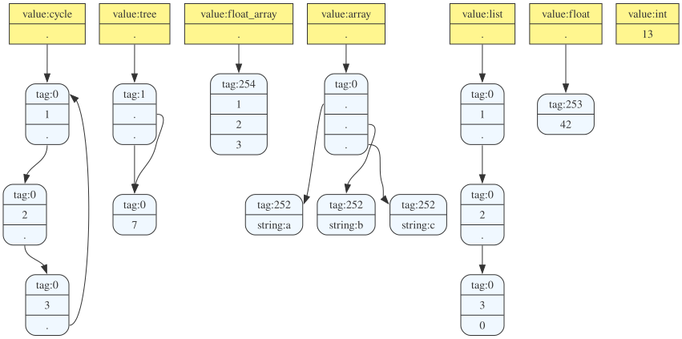

# graphis

Inspects OCaml heap values and lowers the reachable object graph to
Graphviz DOT.



## API

The capture context is the alias analysis boundary. Values captured through the same context share one address table, so repeated physical values lower to the same node and cycles terminate through the visited set.

```ocaml
Graphis.context (fun ctx ->
  let shared = [| "left"; "right" |] in
  let root = shared, shared in
  Graphis.print_dot Format.std_formatter
    [ "root", Graphis.capture ctx root ])
```

The same graph can be written as DOT for Graphviz:

```ocaml
Graphis.context (fun ctx ->
  let shared = [| "left"; "right" |] in
  let root = shared, shared in
  Graphis.write_dot "heap.dot"
    [ "root", Graphis.capture ctx root ])
```
